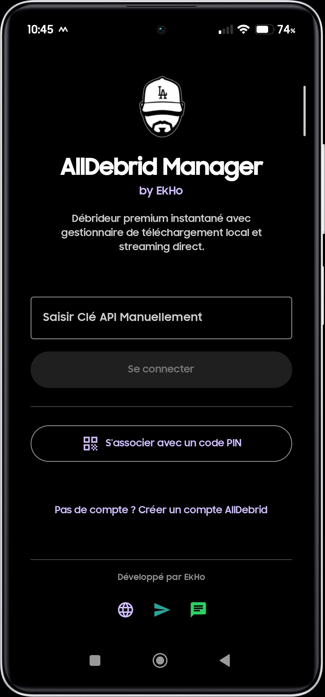
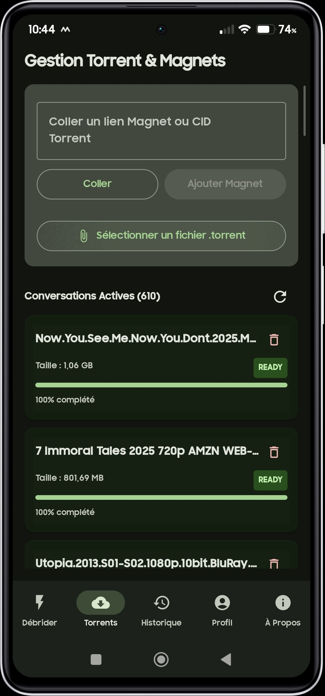

# 🚀 AllDebrid Manager by EkHo

**AllDebrid Manager** est un client Android moderne, fluide et performant conçu pour gérer votre compte AllDebrid de manière intuitive. Que vous souhaitiez débrider des liens, gérer vos torrents ou streamer vos contenus directement sur votre téléviseur ou votre téléphone, l'application centralise tous vos besoins premium dans une interface utilisateur soignée.

---

## ✨ Fonctionnalités Clés

### ⚡ Débridage Instantané & Streaming Direct
- **Débridez en 1 Clic** : Collez n'importe quel lien d'hébergeur compatible (Uptobox, 1fichier, Rapidgator, etc.) et obtenez instantanément le lien premium haut débit.
- **Lecteur Vidéo Intégré** : Visionnez vos vidéos débridées directement dans l'application grâce à l'intégration d'un lecteur média natif performant basé sur ExoPlayer.
- **Gestion des Téléchargements** : Lancez vos téléchargements en local d'un simple clic avec le gestionnaire de téléchargement Android natif.

### 🧲 Gestionnaire Avancé de Torrents & Magnets
- **Ajout Multi-Source** : Ajoutez vos fichiers `.torrent` locaux ou collez simplement des liens Magnet.
- **Suivi en Temps Réel** : Visualisez l'état de conversion (téléchargement par AllDebrid, seeders, vitesse, progression).
- **Explorateur de Fichiers** : Parcourez l'arborescence des dossiers et fichiers de vos torrents terminés, puis débridez et streamez les fichiers individuels de votre choix.

### 📺 Support Natif Google Cast (Chromecast)
- **Diffusion Grand Écran** : Diffusez vos vidéos en haute définition directement sur votre TV en utilisant l'icône Cast intégrée.
- **Conversion Dynamique (MIME-Type)** : Détection intelligente des formats vidéo (`.mp4`, `.mkv`, `.ts`, `.m3u8`) pour assurer une compatibilité et une lecture optimale sur les récepteurs Chromecast.
- **Contrôles Intégrés** : Gérez la lecture (Play, Pause, position de lecture) depuis le panneau de contrôle de votre smartphone.

### 🎨 Design Premium & AMOLED Noir Pur
- **Thème Sombre & AMOLED** : Profitez d'un thème noir pur spécialement adapté aux écrans AMOLED afin d'économiser votre batterie tout en profitant d'un superbe design moderne.
- **Personnalisation de l'Avatar** : Modifiez, réinitialisez et chargez vos photos de profil directement dans l'application avec un rafraîchissement immédiat de l'interface.
- **Optimisé pour tous les Écrans** : Interface adaptative pour smartphones, tablettes et écrans pliables (mode paysage avec barre de navigation latérale dynamique).

### 🔄 Mises à Jour In-App Premium
- **Notification Instantanée** : L'application intègre un vérificateur de mise à jour premium qui vous alerte dès qu'une nouvelle version est disponible.
- **Notes de Version** : Consultez les nouveautés détaillées directement dans l'application et téléchargez la mise à jour instantanément.

---

## 🛠️ Comment ça Marche ?

1. **Association Ultra Simple** :
   - Au premier lancement, connectez-vous instantanément en générant un code PIN d'association à valider sur votre compte AllDebrid, ou saisissez votre clé API manuellement.
   - Si vous n'avez pas de compte, un lien de création rapide est intégré.
2. **Utilisation** :
   - **Débrider** : Collez vos liens dans l'onglet *Débrider*.
   - **Torrents** : Ajoutez et suivez vos fichiers magnétiques ou torrents dans l'onglet *Torrents*.
   - **Historique** : Retrouvez l'historique complet de tous vos liens débridés pour les re-télécharger ou les re-streamer à tout moment.

---

## 📸 Aperçus & Design

*Interface moderne et épurée respectant les lignes directrices de Material Design 3 :*

| Connexion & Association PIN | Gestionnaire de Torrents | Mode AMOLED Noir Pur |
|:---:|:---:|:---:|
|  |  |  |

*(Images d'illustration à titre de démonstration de l'interface utilisateur)*

---

## 📥 Téléchargements

Rendez-vous dans la section **[Releases](https://github.com/BullShieldTeck/ALLDEBRID/releases)** pour télécharger la dernière version stable de l'application au format APK :

1. Téléchargez le fichier `AllDebrid_Manager_release.apk`.
2. Autorisez l'installation d'applications de sources inconnues dans les paramètres de votre appareil si nécessaire.
3. Installez l'APK et profitez de vos contenus !

---

## 🔒 Confidentialité & Sécurité
- L'application communique exclusivement et directement avec les API sécurisées d'**AllDebrid** (`api.alldebrid.com`).
- Vos identifiants et clés API sont stockés localement sur votre appareil de façon chiffrée via les préférences système Android et ne sont **jamais** partagés avec des serveurs tiers.

---

## ⚖️ Clause de Non-Responsabilité (Disclaimer)
*Cette application est un projet indépendant et n'est pas affiliée à, ni approuvée par AllDebrid. Vous devez posséder un compte AllDebrid valide pour pouvoir utiliser les fonctionnalités de cette application.*

## 📄 Licence et Droits d'auteur
Tous droits réservés. 
Il est interdit de modifier ou décompiler cet APK sans autorisation préalable.